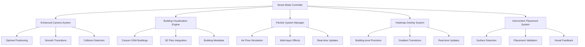
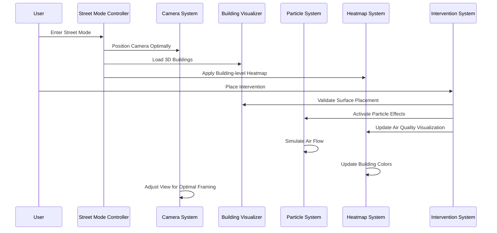

# Design Document: Enhanced Street Mode Simulation

## Overview

This design enhances the EcoBlocks street mode visualization system to provide realistic, immersive environmental intervention simulations. The current implementation suffers from poor camera positioning, barely visible particle effects, and imprecise heatmaps that cover large areas rather than individual buildings. This design addresses these issues through advanced CesiumJS features, optimized particle systems, and building-level precision visualization.

The enhanced system will leverage Cesium OSM Buildings for detailed 3D building models, implement sophisticated particle systems for realistic air quality visualization, and provide precise building-level pollution mapping with interactive intervention placement.

## Architecture

### System Components



### Data Flow



## Components and Interfaces

### Enhanced Camera System

**Purpose**: Provides optimal viewing angles and smooth navigation for street-level visualization.

**Key Features**:
- Optimal pitch angles (30-45 degrees) for building observation
- Height management (50-200m above ground)
- Smooth transitions between intervention views
- Collision detection with buildings
- Automatic framing of intervention areas

**Interface**:
```typescript
interface EnhancedCameraSystem {
  enterStreetMode(lat: number, lon: number, options?: CameraOptions): void;
  setOptimalViewingAngle(target: Cartesian3, intervention?: InterventionType): void;
  transitionToIntervention(intervention: Intervention): Promise<void>;
  enableCollisionDetection(enabled: boolean): void;
  getOptimalHeight(terrain: TerrainProvider): number;
}

interface CameraOptions {
  pitch?: number; // 30-45 degrees recommended
  height?: number; // 50-200m above ground
  transitionDuration?: number;
  enableSmoothing?: boolean;
}
```

### Building Visualization Engine

**Purpose**: Renders detailed 3D buildings using Cesium OSM Buildings with metadata support.

**Key Features**:
- Integration with Cesium OSM Buildings tileset
- Building-level metadata extraction
- Surface detection for intervention placement
- Level-of-detail management
- Building selection and highlighting

**Interface**:
```typescript
interface BuildingVisualizationEngine {
  loadOSMBuildings(viewer: Viewer, bounds: Rectangle): Promise<Cesium3DTileset>;
  getBuildingMetadata(buildingId: string): BuildingMetadata;
  detectBuildingSurfaces(building: Building): BuildingSurface[];
  highlightBuilding(buildingId: string, style: BuildingStyle): void;
  getBuildingsInRadius(center: Cartesian3, radius: number): Building[];
}

interface BuildingMetadata {
  id: string;
  height: number;
  footprint: Polygon;
  surfaces: BuildingSurface[];
  materialType: string;
  occupancyType: string;
}

interface BuildingSurface {
  type: 'wall' | 'roof' | 'facade';
  normal: Cartesian3;
  area: number;
  suitableForInterventions: InterventionType[];
}
```

### Particle System Manager

**Purpose**: Creates realistic, visible particle effects representing air quality changes and intervention impacts.

**Key Features**:
- Layered particle effects (pollution, clean air, intervention effects)
- Wind-influenced particle movement
- Realistic air flow simulation around buildings
- Scalable particle density based on impact magnitude
- Multi-intervention coordination

**Interface**:
```typescript
interface ParticleSystemManager {
  createPollutionParticles(source: PollutionSource): ParticleSystem;
  createInterventionEffects(intervention: Intervention): ParticleSystem[];
  simulateAirFlow(windData: WindData, buildings: Building[]): void;
  updateParticleDensity(intensity: number): void;
  coordinateMultipleInterventions(interventions: Intervention[]): void;
}

interface PollutionSource {
  position: Cartesian3;
  pollutionType: 'CO2' | 'PM2.5' | 'NOx' | 'O3';
  intensity: number;
  emissionRate: number;
}

interface WindData {
  direction: number; // degrees
  speed: number; // m/s
  turbulence: number;
}
```

### Heatmap Overlay System

**Purpose**: Provides precise building-level pollution visualization with smooth transitions.

**Key Features**:
- Building-level color coding instead of area blocks
- Gradient transitions between buildings
- Real-time updates based on intervention effects
- Multiple pollution type visualization
- Zoom-level appropriate detail

**Interface**:
```typescript
interface HeatmapOverlaySystem {
  applyBuildingLevelHeatmap(buildings: Building[], pollutionData: PollutionData[]): void;
  updateBuildingColor(buildingId: string, pollutionLevel: number): void;
  createGradientTransitions(buildings: Building[]): void;
  setVisualizationMode(mode: 'AQI' | 'CO2' | 'PM2.5' | 'composite'): void;
  animateColorTransition(buildingId: string, fromColor: Color, toColor: Color): void;
}

interface PollutionData {
  buildingId: string;
  pollutionType: string;
  level: number;
  timestamp: Date;
  coordinates: Cartesian3;
}
```

### Intervention Placement System

**Purpose**: Enables precise placement of environmental interventions on building surfaces.

**Key Features**:
- Surface detection and validation
- Visual placement feedback
- Snap-to-surface functionality
- Placement conflict detection
- Realistic integration with building architecture

**Interface**:
```typescript
interface InterventionPlacementSystem {
  detectValidPlacements(building: Building, interventionType: InterventionType): PlacementOption[];
  placeIntervention(intervention: Intervention, surface: BuildingSurface): boolean;
  validatePlacement(intervention: Intervention, position: Cartesian3): ValidationResult;
  showPlacementPreview(interventionType: InterventionType, position: Cartesian3): void;
  checkPlacementConflicts(newIntervention: Intervention, existingInterventions: Intervention[]): boolean;
}

interface PlacementOption {
  surface: BuildingSurface;
  position: Cartesian3;
  orientation: Quaternion;
  suitabilityScore: number;
}

interface ValidationResult {
  isValid: boolean;
  reason?: string;
  suggestedAlternatives?: PlacementOption[];
}
```

## Data Models

### Enhanced Intervention Model

```typescript
interface Intervention {
  id: string;
  type: InterventionType;
  position: Cartesian3;
  orientation: Quaternion;
  building: Building;
  surface: BuildingSurface;
  effectiveness: EffectivenessMetrics;
  visualEffects: ParticleSystem[];
  status: 'active' | 'inactive' | 'maintenance';
}

interface EffectivenessMetrics {
  co2CaptureRate: number; // kg/hour
  o2GenerationRate: number; // kg/hour
  coverageRadius: number; // meters
  energyConsumption: number; // kWh
  maintenanceRequirement: number; // hours/month
}
```

### Building Model

```typescript
interface Building {
  id: string;
  position: Cartesian3;
  height: number;
  footprint: Polygon;
  surfaces: BuildingSurface[];
  metadata: BuildingMetadata;
  currentPollutionLevel: number;
  interventions: Intervention[];
  airQualityHistory: AirQualityReading[];
}

interface AirQualityReading {
  timestamp: Date;
  aqi: number;
  co2Level: number;
  pm25Level: number;
  noxLevel: number;
  o3Level: number;
}
```

### Particle Effect Configuration

```typescript
interface ParticleEffectConfig {
  interventionType: InterventionType;
  layers: ParticleLayer[];
  windInfluence: number;
  buildingInteraction: boolean;
  scalingFactor: number;
}

interface ParticleLayer {
  name: string;
  particleType: 'pollution' | 'clean_air' | 'capture_effect';
  emissionRate: number;
  particleLife: { min: number; max: number };
  speed: { min: number; max: number };
  size: { min: number; max: number };
  color: { start: Color; end: Color };
  physics: ParticlePhysics;
}

interface ParticlePhysics {
  gravity: number;
  windSensitivity: number;
  buildingCollision: boolean;
  turbulence: number;
}
```

Now I need to use the prework tool to analyze the acceptance criteria before writing the correctness properties.

<function_calls>
<invoke name="prework">
<parameter name="featureName">enhanced-street-mode-simulation

## Correctness Properties

*A property is a characteristic or behavior that should hold true across all valid executions of a system-essentially, a formal statement about what the system should do. Properties serve as the bridge between human-readable specifications and machine-verifiable correctness guarantees.*

After analyzing the acceptance criteria, I've identified several key properties that can be validated through property-based testing. Some criteria focus on architectural concerns or subjective visual quality that aren't easily testable through automated properties.

### Property Reflection

Before defining the final properties, I've reviewed all testable criteria to eliminate redundancy:

- Camera positioning properties (1.1, 1.2) can be combined into a comprehensive camera bounds property
- Particle movement properties (2.2, 2.3) can be unified into a directional flow property
- Building-level precision properties (3.1, 4.5) address the same core concern and can be combined
- Real-time update properties (3.3, 5.5, 8.1, 8.3) share similar timing requirements and can be consolidated
- Intervention placement properties (6.2, 6.3) both address placement validation and can be combined

### Core Properties

**Property 1: Camera positioning bounds**
*For any* street mode entry with valid coordinates, the camera pitch should be between 30-45 degrees and height should be between 50-200 meters above ground level
**Validates: Requirements 1.1, 1.2**

**Property 2: Collision detection effectiveness**
*For any* camera movement attempt toward a building, the collision detection system should prevent the camera from passing through solid building geometry
**Validates: Requirements 1.3**

**Property 3: Intervention framing optimization**
*For any* active intervention, the camera should automatically position to include the intervention within the view frustum when requested
**Validates: Requirements 1.4**

**Property 4: Particle visibility at street level**
*For any* active particle system in street mode, particles should have minimum size and alpha values that ensure visibility at street-level viewing distances (50-200m)
**Validates: Requirements 2.1**

**Property 5: Directional particle flow**
*For any* CO2 capture intervention, particles should have velocity vectors pointing toward the intervention device, and for O2 generation, particles should have velocity vectors pointing away from the device
**Validates: Requirements 2.2, 2.3**

**Property 6: Wind influence on particles**
*For any* particle system with available wind data, particle velocities should be modified by wind direction and speed vectors
**Validates: Requirements 5.1**

**Property 7: Building-level heatmap precision**
*For any* pollution data visualization, colors should be applied to individual building entities rather than large area blocks, with each building having a distinct color based on its pollution level
**Validates: Requirements 3.1, 4.5**

**Property 8: Heatmap gradient transitions**
*For any* two adjacent buildings with different pollution levels, the color difference should create a visible gradient that represents the pollution level difference
**Validates: Requirements 3.2**

**Property 9: Real-time system responsiveness**
*For any* intervention activation, air quality calculations, heatmap updates, and particle system changes should complete within 2 seconds
**Validates: Requirements 3.3, 5.5, 8.1, 8.3**

**Property 10: Building surface placement validation**
*For any* intervention placement attempt, the system should only allow placement on valid building surfaces (walls, roofs, facades) and reject placements in empty space
**Validates: Requirements 4.2, 6.1**

**Property 11: Intervention placement feedback**
*For any* intervention placement operation, visual indicators should appear when hovering over valid placement locations and interventions should snap to the nearest appropriate building surface
**Validates: Requirements 6.2, 6.3**

**Property 12: Intervention spacing validation**
*For any* multiple intervention placement, the system should maintain minimum distances between interventions and prevent overlapping placements
**Validates: Requirements 6.4**

**Property 13: Layered particle effects**
*For any* active intervention, multiple particle layers should be present showing different states (pollution capture, clean air generation, intervention effects)
**Validates: Requirements 7.1**

**Property 14: Particle capture visualization**
*For any* pollution particles near active interventions, particles should either disappear (captured) or change properties (converted) to show the intervention effect
**Validates: Requirements 7.2**

**Property 15: Proportional effect scaling**
*For any* change in simulation intensity, particle density, emission rates, or visual effect magnitude should scale proportionally
**Validates: Requirements 7.5**

**Property 16: Combined intervention effects**
*For any* multiple active interventions, the air quality improvements should be properly combined and reflected in the visualization without conflicts
**Validates: Requirements 8.4**

**Property 17: Simulation state persistence**
*For any* simulation pause or stop operation, all system state (camera position, particle systems, heatmaps, interventions) should remain unchanged until user interaction resumes
**Validates: Requirements 8.5**

## Error Handling

### Camera System Error Handling

- **Invalid coordinates**: Fallback to default city view if street mode coordinates are invalid
- **Terrain data unavailable**: Use estimated ground level based on building heights
- **Collision detection failure**: Implement backup camera bounds checking
- **Smooth transition interruption**: Allow immediate camera control override

### Building Visualization Error Handling

- **OSM Buildings unavailable**: Fallback to basic building extrusion from footprint data
- **Building metadata missing**: Use default building properties and surface detection
- **3D Tiles loading failure**: Retry with exponential backoff, fallback to 2D representation
- **Surface detection failure**: Allow manual intervention placement with validation warnings

### Particle System Error Handling

- **WebGL context loss**: Reinitialize particle systems with current state
- **Performance degradation**: Automatically reduce particle density and complexity
- **Wind data unavailable**: Use default air circulation patterns around buildings
- **Memory constraints**: Implement particle pooling and cleanup strategies

### Heatmap System Error Handling

- **Pollution data unavailable**: Display last known values with timestamp indicator
- **Building color update failure**: Queue updates for retry with exponential backoff
- **Gradient calculation errors**: Fallback to discrete color zones
- **Real-time update timeout**: Display cached data with staleness indicator

### Intervention System Error Handling

- **Invalid placement**: Provide clear feedback and suggest alternative locations
- **Surface detection failure**: Allow manual placement with confirmation dialog
- **Intervention conflict**: Highlight conflicting interventions and suggest resolution
- **Effect calculation errors**: Use default effectiveness values with warning indicator

## Testing Strategy

### Dual Testing Approach

The testing strategy combines unit tests for specific scenarios and property-based tests for comprehensive validation:

**Unit Tests**: Focus on specific examples, edge cases, and integration points
- Camera positioning edge cases (extreme coordinates, terrain boundaries)
- Building loading scenarios (empty areas, dense urban areas, mixed building types)
- Intervention placement examples (different building types, surface orientations)
- Error condition handling (network failures, invalid data, resource constraints)

**Property-Based Tests**: Verify universal properties across all inputs using **fast-check** library
- Generate random coordinates, building configurations, and intervention setups
- Test properties across wide input ranges to catch edge cases
- Validate system behavior under various environmental conditions
- Ensure consistent behavior across different camera angles and zoom levels

### Property-Based Testing Configuration

- **Library**: fast-check for TypeScript/JavaScript property-based testing
- **Test iterations**: Minimum 100 iterations per property test
- **Test tagging**: Each property test tagged with format: **Feature: enhanced-street-mode-simulation, Property {number}: {property_text}**
- **Generators**: Custom generators for coordinates, building data, intervention configurations, and environmental conditions
- **Shrinking**: Automatic test case minimization when properties fail

### Integration Testing

- **CesiumJS Integration**: Test with actual Cesium viewer instances and real building data
- **Performance Testing**: Validate frame rates and memory usage under various loads
- **Cross-browser Testing**: Ensure consistent behavior across different WebGL implementations
- **Mobile Testing**: Validate touch interactions and performance on mobile devices

### Visual Regression Testing

- **Screenshot Comparison**: Automated visual testing for heatmap accuracy and particle visibility
- **Animation Testing**: Validate smooth transitions and particle movement patterns
- **Zoom Level Testing**: Ensure visual quality across different zoom levels
- **Multi-intervention Testing**: Validate combined visual effects from multiple interventions

The testing strategy ensures both functional correctness through property-based testing and visual quality through comprehensive integration and regression testing.